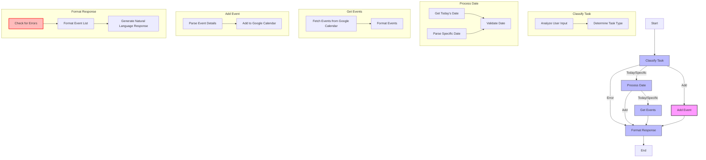

```mermaid
graph TD
    A[Start] --> B[Classify Task]
    B -->|Error| F[Format Response]
    B -->|Today/Specific| C[Process Date]
    B -->|Add| E[Add Event]
    C -->|Today/Specific| D[Get Events]
    C -->|Add| F
    D --> F
    E --> F
    F --> G[End]

    subgraph Classify Task
    B1[Analyze User Input]
    B2[Determine Task Type]
    B1 --> B2
    end

    subgraph Process Date
    C1[Get Today's Date]
    C2[Parse Specific Date]
    C1 --> C3[Validate Date]
    C2 --> C3
    end

    subgraph Get Events
    D1[Fetch Events from Google Calendar]
    D2[Format Events]
    D1 --> D2
    end

    subgraph Add Event
    E1[Parse Event Details]
    E2[Add to Google Calendar]
    E1 --> E2
    end

    subgraph Format Response
    F1[Check for Errors]
    F2[Format Event List]
    F3[Generate Natural Language Response]
    F1 --> F2
    F2 --> F3
    end

    classDef addFlow fill:#f9f,stroke:#333,stroke-width:2px;
    class E addFlow;
    
    classDef normalFlow fill:#bbf,stroke:#333,stroke-width:1px;
    class B,C,D,F normalFlow;
    
    classDef errorFlow fill:#fbb,stroke:#f00,stroke-width:2px;
    class F1 errorFlow;
```